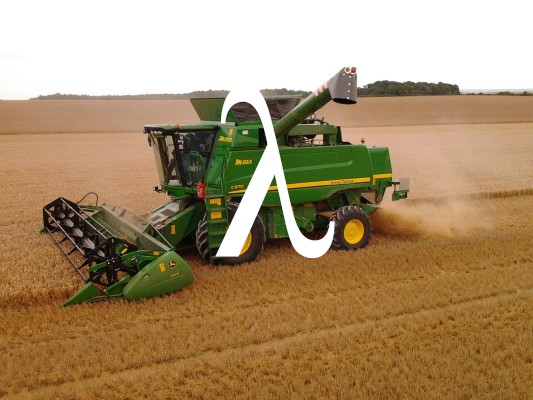

# PARSERCOM
I want to know how parser combinators work.

##### *An artists impression of a typical Parser Combinator in the wild*

Note that at this time this does almost nothing.

## Requirements 
Hopefully none - it would be nice if this was a completely standalone project.

